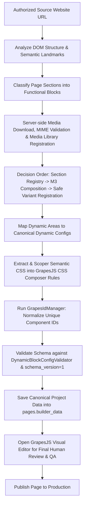

# GrapesJS Clone & AI Importer Pipeline Contract (v1.0.0-freeze)

## 1. M7 Clone Pipeline Architecture

---

## 2. Importer Component Allowlist

The AI Importer is **STRICTLY ALLOWED** to generate only components from this allowlist:

| Category | Allowed Component Types | Role Metadata Support |
| :--- | :--- | :--- |
| **Containers** | `builder-section`, `builder-container`, `builder-grid`, `builder-columns`, `builder-column`, `builder-stack` | N/A |
| **Typography & Content** | `builder-heading`, `builder-paragraph`, `builder-button`, `image`, `builder-divider`, `builder-spacer`, `builder-icon`, `builder-video` | `role`: `section-title`, `section-subtitle`, `section-description`, `primary-action`, `secondary-action`, `service-item`, `project-item`, `stat-value`, `stat-label` |
| **Predefined Sections** | `builder-section` with registered `sectionType` & `variant` | N/A |
| **Dynamic Data Blocks** | `builder-dynamic-product-grid`, `builder-dynamic-product-tabs`, `builder-dynamic-category-grid`, `builder-dynamic-post-list`, `builder-dynamic-latest-reviews`, `builder-dynamic-contact-form`, `builder-partial` | `dynamicType`: `product-grid`, `product-tabs`, `category-grid`, `post-list`, `latest-reviews`, `contact-form`, `partial` |

### Forbidden Elements (NEVER GENERATED by Importer)
- Executable JavaScript `<script>` tags or third-party tracker scripts.
- Inline event handlers (`onclick`, `onload`, `onerror`).
- `javascript:`, `data:` URLs.
- Raw unstructured HTML blobs (dumping raw `
...500 lines...
`).
- Database snapshot records in `builder_data` (products, posts, prices, reviews).

---

## 3. Importer Decision Order & Fallback Strategy

For every section detected on the source website:

1. **Step 1: Identify Semantic Purpose**
   - Classify section intent: `hero`, `about`, `services`, `projects`, `gallery`, `cta`, `contact`, `catalog/products`, `posts/news`, `reviews`.
2. **Step 2: Check Dynamic Capability**
   - If the region represents live catalog/news/contact, map directly to an official **Dynamic Block** (`product-grid`, `post-list`, `contact-form`, etc.) with pure `config`.
3. **Step 3: Search Predefined Section Registry**
   - If static/pattern, find best matching variant in `GrapesSectionRegistry` (e.g. `hero-01`, `about-02`).
   - Populate content into role targets (`section-title`, `section-description`, `primary-action`, image `mediaRef`).
4. **Step 4: Compose from M3 Basic Components**
   - If no variant matches, construct a clean composite tree using `builder-section` $\rightarrow$ `builder-container` $\rightarrow$ `builder-grid`/`builder-columns` $\rightarrow$ `builder-heading` / `builder-paragraph` / `image` / `builder-button`.
5. **Step 5: Register Reusable Variant (If Applicable)**
   - If the layout is high-quality and reusable across the site, register a new safe variant in Section Registry with semantic CSS Composer rules.
6. **Step 6: Fallback Handling**
   - If an unsupported complex widget is encountered (e.g. 3rd-party calculator/3D viewer), report as an unsupported section for human design review rather than injecting unmanaged raw HTML.

---

## 4. Media Import & Deduplication Policy

1. **Download & Import:**
   - Remote image URLs from the source site must be downloaded server-side.
   - MIME types must be strictly validated (`image/jpeg`, `image/png`, `image/webp`, `image/svg+xml`).
   - Saved into Laravel Media Storage (`MediaController` / Spatie MediaLibrary).
2. **Media Reference (`mediaRef`):**
   - Canonical image component receives `mediaRef: "media:path/to/file.webp"`.
   - `attributes.src` is assigned the resolved current storage URL.
3. **Strict Constraints:**
   - No base64 encoded strings in `builder_data`.
   - No temporary `blob:` URLs or local filesystem paths.
   - No external hotlinks in the final published state.

---

## 5. CSS & JavaScript Import Isolation

- **CSS Extraction:**
  - Extract only typography, spacing, colors, and layout properties directly applied to components.
  - Scoped to semantic builder classes and registered in GrapesJS CSS Composer with media queries (`@media (max-width: 992px)`, `@media (max-width: 768px)`, `@media (max-width: 480px)`).
  - Never import external framework bundles (e.g., entire bootstrap.css or global CSS stylesheets).
- **JavaScript Isolation:**
  - Source site JavaScript is strictly discarded.
  - Interactive behaviors are fulfilled by built-in Core capabilities (responsive menus, tabs, contact endpoints, standard CSS transitions).

---

## 6. Legal, Authorization & Safety Boundary

- The clone pipeline is strictly intended for migrating authorized websites and content owned or licensed by the operator.
- The pipeline will never attempt to bypass authentication mechanisms, paywalls, CAPTCHAs, or anti-bot protections.
- Credential harvesting or unauthorized scraping of protected data is strictly forbidden.
