# Hướng dẫn sử dụng UI/UX Builder

> Bản trực quan ngày 09/09/2026: [Sổ tay PDF 24 trang dùng trực tiếp trong Builder](handbook/HUONG-DAN-UIUX-BUILDER.pdf), với ảnh chụp mới có khoanh số/mũi tên và hướng dẫn thao tác ngay dưới ảnh. Phần dưới giữ nguyên hướng dẫn của đợt 08/09/2026.

Ngày kiểm tra: 08/09/2026. Dành cho người quản trị nội dung website hiện tại.

Ảnh trong tài liệu được chụp bằng Chromium từ giao diện thực, chạy trên bản kiểm thử localhost dùng cùng mã nguồn và bản sao nội dung CMS. Thao tác lưu/xuất bản trong kiểm thử dùng cơ sở dữ liệu tạm. Thư viện ảnh trong bản kiểm thử không có dữ liệu Media thật. Xem [báo cáo kiểm thử và các điểm còn tồn tại](BAO-CAO-KIEM-THU.md) trước khi nghiệm thu.

## 1. Quy trình làm việc

**Mở đúng trang → sửa nội dung → kiểm tra máy tính, tablet, điện thoại → lưu nháp → mở lại kiểm tra → xuất bản → kiểm tra URL công khai.**

| Thao tác | Ý nghĩa nghiệp vụ |
| --- | --- |
| Lưu nháp / Ctrl+S | Lưu thiết kế đang sửa; khách vẫn xem phiên bản đã xuất bản trước đó. |
| Xuất bản | Đưa nội dung của ngôn ngữ đang sửa ra website sau khi xác nhận. |
| Thông tin trang | Quản lý tên, đường dẫn, trạng thái, SEO và lựa chọn bố cục. Không dùng màn hình này để sửa thiết kế trang đã có. |
| Sửa Header / Sửa Footer | Mở phần đầu/chân trang được lựa chọn. Phần dùng chung có thể ảnh hưởng nhiều trang khi xuất bản. |
| Hoàn tác / Làm lại | Sửa thao tác trong phiên đang mở; không thay thế bản lưu hoặc lịch sử phiên bản. |

Nhãn “Đã xuất bản” mô tả trạng thái trang. Sau khi sửa, hãy bấm Lưu nháp và chờ thông báo thành công; đừng dựa riêng vào nhãn này để kết luận thay đổi đã được lưu.

## 2. Vào đúng trang và đúng ngôn ngữ

1. Đăng nhập quản trị bằng tài khoản có quyền quản lý trang.
2. Mở danh sách trang, tìm theo tên/đường dẫn cần sửa.
3. Mở **Thiết kế (Builder)** của trang đó. Nếu đang ở màn hình thông tin, dùng nút mở Builder.
4. Kiểm tra tên trang trên thanh trên cùng. Nếu website bật nhiều ngôn ngữ, chọn đúng ngôn ngữ nội dung trước khi nhập.
5. Lưu công việc trước khi chuyển trang hoặc ngôn ngữ.

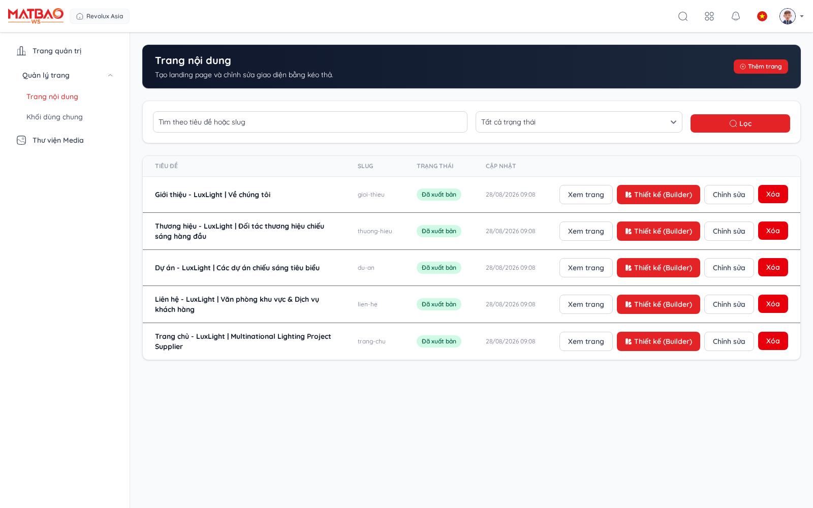

Trang Giới thiệu, Thương hiệu, Dự án và Liên hệ có nội dung riêng. Không sửa Header để thay phần thân một trang. Một trang chưa có bản dịch cần được nhập và kiểm tra ở đúng ngôn ngữ; việc sửa tiếng Việt không có nghĩa các bản dịch đã được dịch tự động.

## 3. Nhận biết các vùng trong Builder

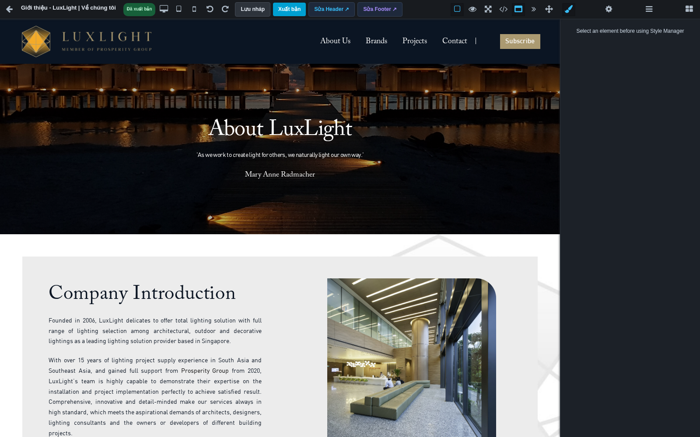

| Vị trí | Công dụng |
| --- | --- |
| Thanh trên | Tên trang, thiết bị xem, hoàn tác/làm lại, Lưu nháp, Xuất bản, mở Header/Footer. |
| Vùng giữa | Trang đang thiết kế. Bấm chọn phần tử; nhấp đúp để sửa phần chữ hỗ trợ chỉnh trực tiếp. |
| Biểu tượng cọ | Kiểu dáng: chữ, màu, kích thước, khoảng cách, viền và bố cục. |
| Biểu tượng bánh răng | Thuộc tính riêng của phần tử: thẻ tiêu đề, URL, ảnh, cấu hình khối… |
| Biểu tượng các dòng | Cây lớp: cấu trúc cha/con để chọn chính xác phần tử nằm sâu. |
| Biểu tượng các ô | Thư viện khối để thêm nội dung. |

Di chuột lên biểu tượng để đọc chú thích. Header/Footer được hiển thị làm ngữ cảnh có thể chỉ xem; dùng nút riêng để mở trình sửa tương ứng. Khung xem trước ẩn công cụ giúp quan sát bố cục, nhưng vẫn cần kiểm tra trang công khai vì menu, biểu mẫu và nội dung động có vòng đời riêng.

## 4. Sửa chữ, tiêu đề và liên kết

1. Bấm vào tiêu đề/đoạn văn cần sửa. Nếu chọn nhầm cả vùng, mở cây lớp để chọn phần chữ bên trong.
2. Nhấp đúp vào chữ để nhập nội dung. Bôi đen phần chữ cần định dạng bằng thanh công cụ văn bản.
3. Bấm ra ngoài vùng chữ để kết thúc chỉnh sửa, rồi Lưu nháp.
4. Mở lại trang và kiểm tra chữ vừa nhập vẫn còn.
5. Với khối Heading, chọn cấp H1/H2/H3 trong Thuộc tính. Thường dùng một H1 cho chủ đề chính, H2 cho từng mục, H3 cho mục nhỏ.
6. Với nút/liên kết, nhập URL trong Thuộc tính. Dùng đường dẫn nội bộ đúng như `/lien-he`; sau xuất bản phải bấm thử liên kết.

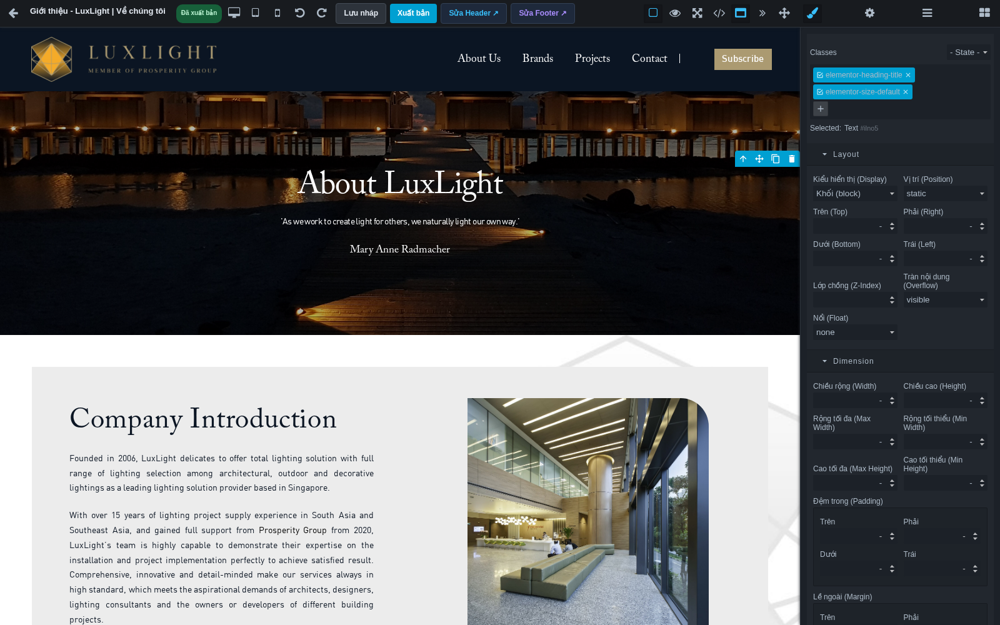

Ví dụ: đổi “Company Introduction” thành tiêu đề đã duyệt, bấm ra ngoài, lưu nháp và mở lại. Sau đó mới xuất bản. Với dữ liệu như tên sản phẩm hoặc danh sách bài viết từ khối động, sửa ở module nguồn hoặc cấu hình khối; không gõ đè lên kết quả hiển thị rồi kỳ vọng dữ liệu nguồn thay đổi.

## 5. Chỉnh màu, kích thước và khoảng cách

Chọn phần tử trước khi mở bảng kiểu dáng. Nếu bảng báo cần chọn phần tử, bấm lại phần tử trong vùng thiết kế hoặc cây lớp.

- **Font / Font Size / Weight:** phông, cỡ và độ đậm chữ. Dùng bộ phông đang có để giữ thiết kế nhất quán.
- **Color / Background:** màu chữ và nền. Kiểm tra chữ dễ đọc trên ảnh nền.
- **Padding:** khoảng trống bên trong khối. **Margin:** khoảng cách với khối bên ngoài.
- **Width / Max-width:** giới hạn chiều rộng. Ưu tiên phần trăm/giới hạn rộng hợp lý cho nội dung cần co theo màn hình.
- **Border / Radius:** đường viền và bo góc. Tránh áp dụng bo góc lớn cho mọi khối một cách đồng loạt.

Mỗi lần sửa một nhóm nhỏ rồi quan sát. Nếu thay đổi sai, dùng Ctrl+Z. CSS của mẫu nhập có thể tác động qua lớp cha hoặc quy tắc theo thiết bị; hãy kiểm tra đúng phần tử và thiết bị trước khi tăng độ ưu tiên CSS.

## 6. Thêm khối và sắp xếp bố cục

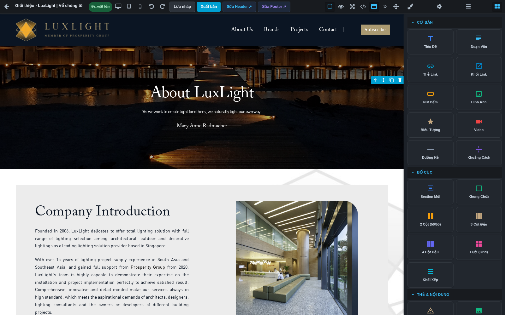

1. Mở Khối, chọn nhóm phù hợp.
2. Kéo khối vào vùng nội dung; quan sát vị trí chèn trước khi thả.
3. Với bố cục cột, đặt nội dung vào từng cột. Chọn khung cột cha để chỉnh khoảng cách giữa các cột.
4. Điền chữ, ảnh, đường dẫn và thuộc tính của khối ngay sau khi thêm.
5. Kiểm tra thứ tự bằng cây lớp, lưu nháp rồi mở lại.

Cây lớp giúp chọn đúng khung cha, di chuyển phần tử và tránh kéo nhầm toàn bộ vùng. Khi xóa, kiểm tra tên/phần được tô sáng trước: xóa khung cha sẽ xóa cả nội dung bên trong. Nếu vừa xóa nhầm trong phiên, dùng Hoàn tác ngay.

Thư viện hiện có 37 khối trong môi trường kiểm tra. Khối động cần dữ liệu và cấu hình phù hợp: danh sách rỗng có thể do chưa có dữ liệu hoặc bộ lọc, không nhất thiết do kéo thả lỗi. Một biểu mẫu HTML được nhập từ website khác không tự có chức năng gửi mail hoặc ghi dữ liệu Laravel.

## 7. Thay ảnh và tải ảnh

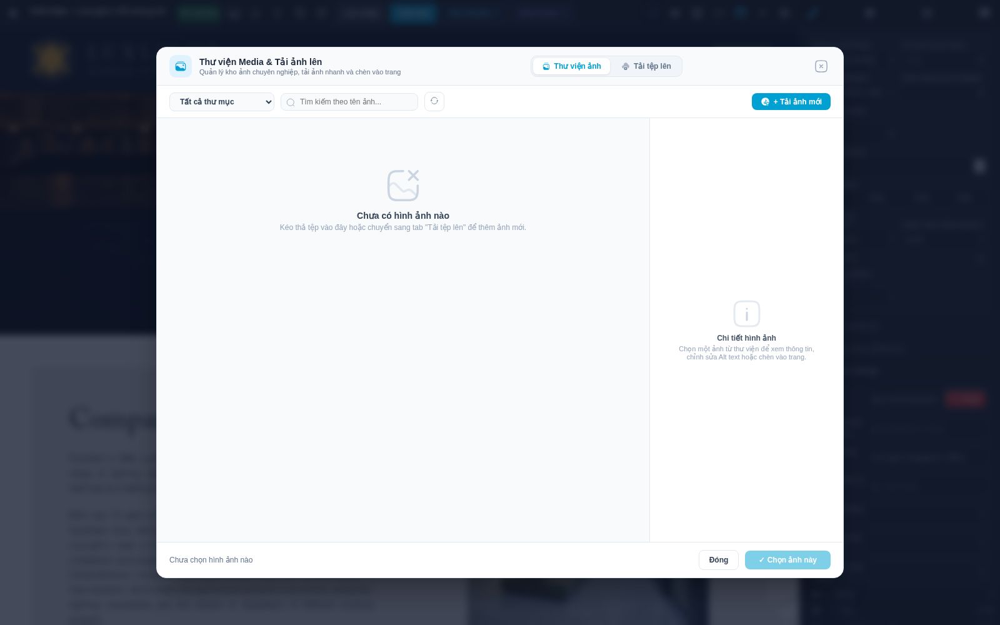

1. Chọn ảnh trong trang, mở Thuộc tính và bấm **Chọn** ở trường ảnh, hoặc nhấp đúp ảnh nếu phần tử hỗ trợ.
2. Tìm theo tên/thư mục trong thư viện. Bấm **Tải thêm ảnh** khi có trang dữ liệu tiếp theo.
3. Chọn ảnh, kiểm tra ảnh xem trước và thông tin bên phải.
4. Bấm **Chọn ảnh này**. Nếu chưa chọn ảnh, nút xác nhận chưa dùng được.
5. Điền Alt mô tả đúng nội dung ảnh, chỉnh cách hiển thị và vị trí trọng tâm nếu ảnh bị cắt.
6. Kiểm tra lại cả điện thoại và máy tính, lưu nháp.

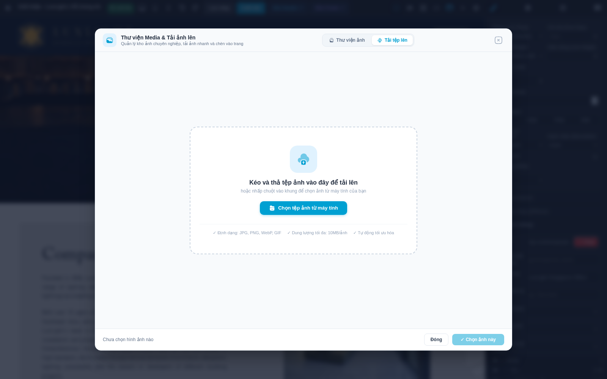

Để thêm ảnh mới, chuyển **Tải tệp lên**, chọn tệp hoặc kéo tệp vào vùng tải. Dùng JPG/JPEG/PNG/WebP/GIF theo quy định upload của hệ thống. Chờ kết quả từng lượt tải. Nếu báo thất bại, đọc thông báo, kiểm tra định dạng/dung lượng/quyền và thử lại; không coi thanh tiến trình 100% là bằng chứng ảnh đã được lưu.

Ảnh trống trong hình minh họa là thư viện của cơ sở dữ liệu kiểm thử. Quy trình tải thật lên Cloudinary chưa được xác nhận trong đợt này. Với ảnh đang dùng ở nhiều nơi, ưu tiên chọn ảnh thay thế cho phần tử cần sửa; việc xóa tài nguyên thư viện có thể ảnh hưởng các nơi còn tham chiếu ảnh đó.

## 8. Kiểm tra responsive

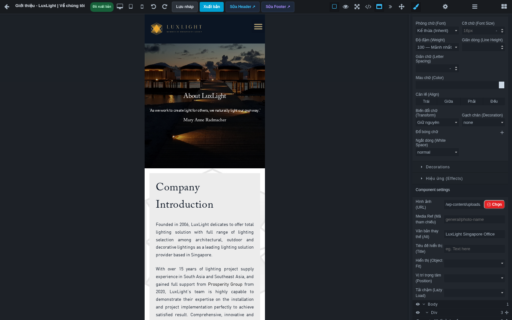

1. Hoàn thiện bố cục máy tính.
2. Chọn tablet **768px**, kiểm tra cột, cỡ chữ, ảnh và khoảng cách.
3. Chọn điện thoại **375px**, cuộn từ đầu đến cuối.
4. Chỉnh phần tử cần thiết khi đang ở thiết bị tương ứng, rồi quay lại desktop để kiểm tra tác động.
5. Kiểm tra trên trình duyệt điện thoại thực sau xuất bản.

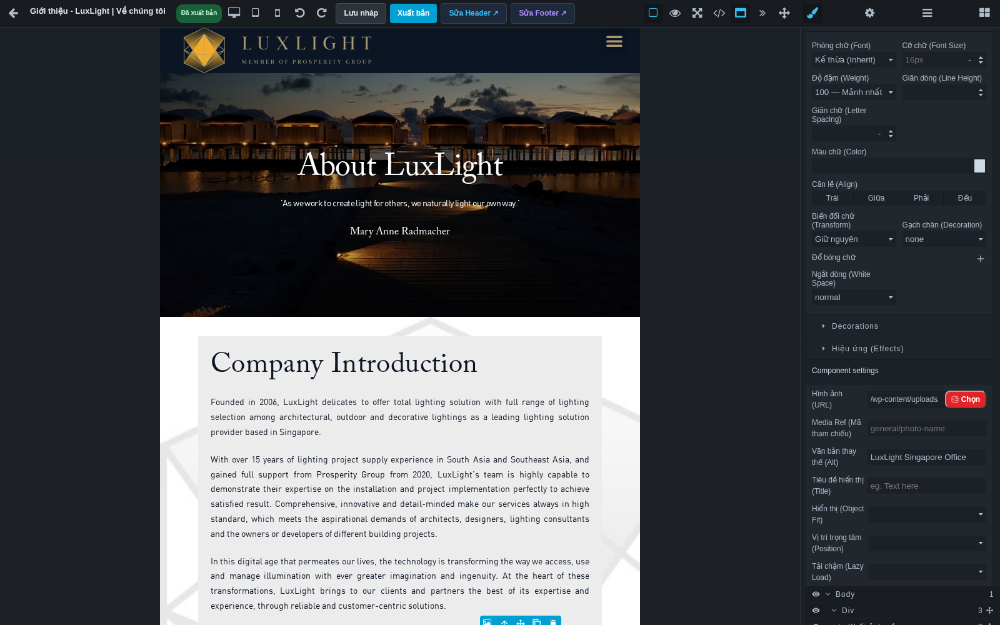

Cần nhìn kỹ: có cuộn ngang không; tiêu đề có tràn không; nút có dễ bấm không; ảnh có cắt mất chủ thể không; cột có cần chuyển thành một cột không. Chọn thiết bị không tự bảo đảm mọi khối nhập sẵn đã có bố cục responsive hợp lý. Không dùng kéo tự do/định vị tuyệt đối cho nội dung dài nếu chưa kiểm tra đủ kích thước.

## 9. Header, Footer và khối dùng chung

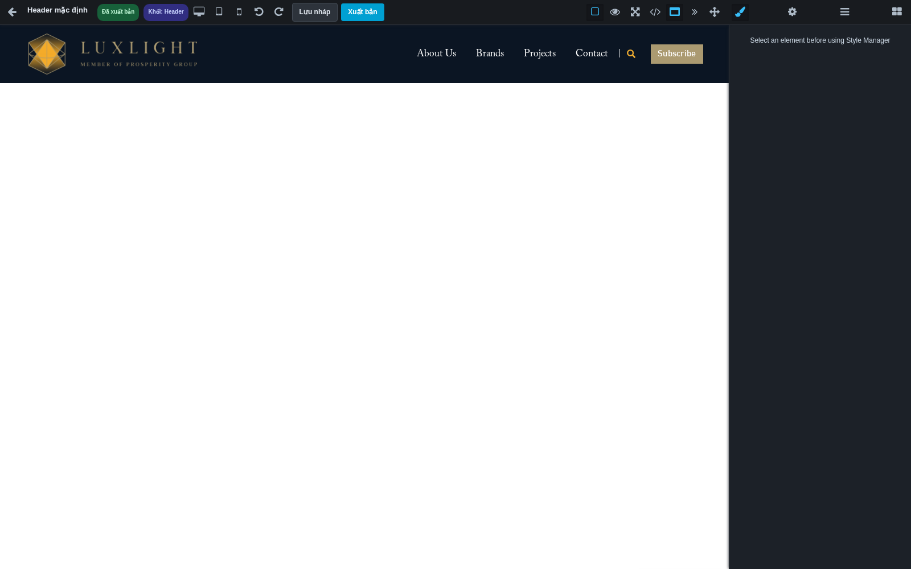

Trên thanh Builder, bấm **Sửa Header** hoặc **Sửa Footer** để mở phần đang áp dụng cho trang. Xác nhận tên phần dùng chung trước khi sửa. Nếu trang chọn không dùng Header/Footer, không nên tự sửa phần mặc định để bù vào.

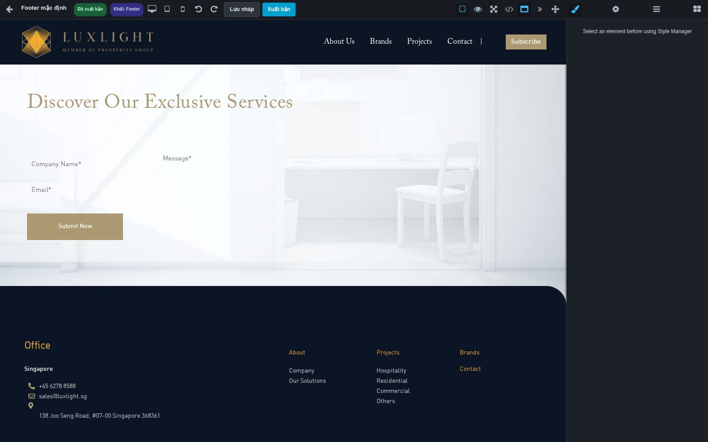

Lưu nháp phần dùng chung chưa thay bản công khai. Khi xuất bản phần này, kiểm tra nhiều trang sử dụng nó, đặc biệt trang chủ và điện thoại. Kiểm tra logo, menu, số điện thoại, email, đường dẫn và khoảng cách chân trang.

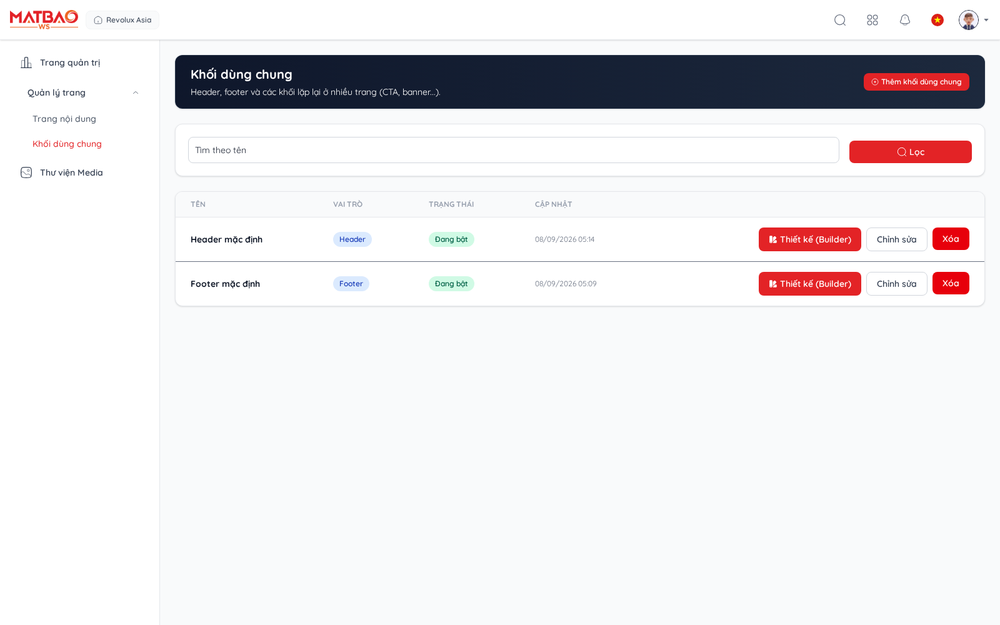

## 10. Thông tin trang và xuất bản

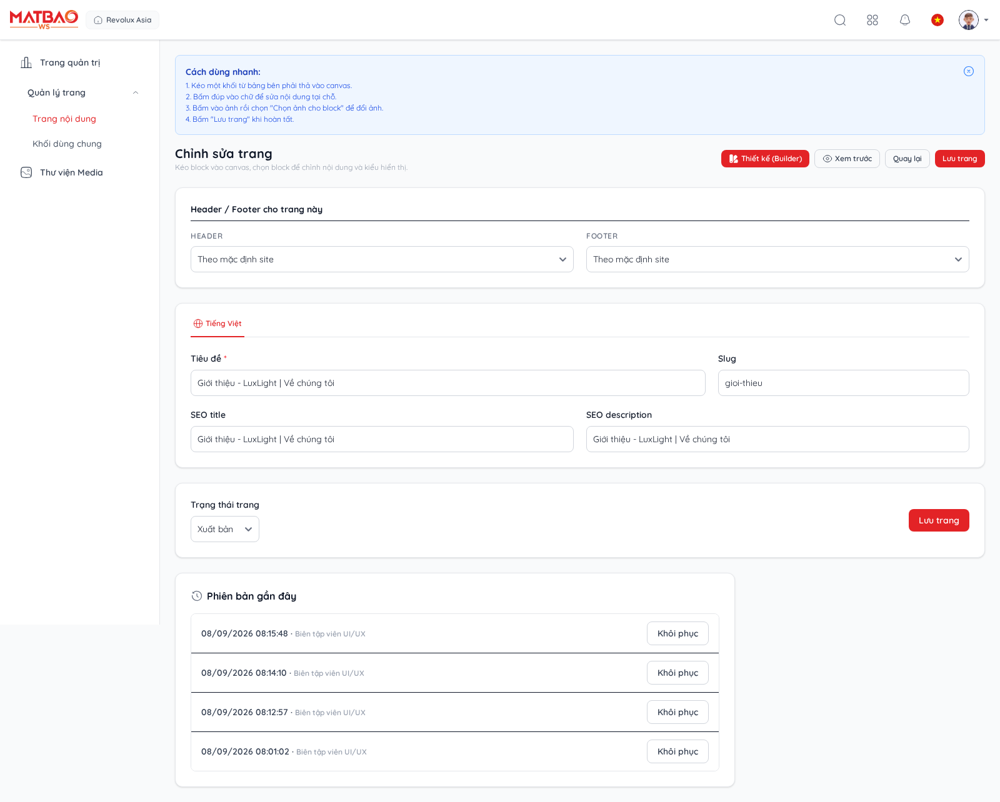

Màn hình thông tin quản lý tiêu đề, đường dẫn, SEO, trạng thái và bố cục theo các trường được cấp quyền. Lưu thông tin của trang đã có phải giữ nguyên thiết kế từng ngôn ngữ. Thay đường dẫn có thể làm liên kết cũ không còn đúng; kiểm tra menu và các nút trỏ đến trang đó.

Trước xuất bản, lưu nháp, mở lại và đối chiếu nội dung đã duyệt. Bấm **Xuất bản**, đọc hộp xác nhận và chỉ xác nhận khi muốn khách xem phiên bản mới.

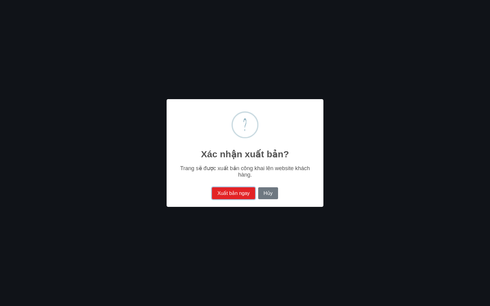

Sau khi có thông báo thành công, mở URL công khai trong tab riêng và tải lại. Với các trang chính hiện tại, kiểm tra `/`, `/gioi-thieu`, `/thuong-hieu`, `/du-an`, `/lien-he`. Kiểm tra cả chữ, ảnh, Header/Footer và thao tác thực tế, không chỉ ảnh chụp trong Builder.

## 11. Xử lý tình huống thường gặp

| Hiện tượng | Cách xử lý |
| --- | --- |
| Không sửa được chữ | Chọn phần chữ trong cây lớp; nhấp đúp. Dữ liệu động cần sửa ở nguồn. |
| Không thấy thay đổi ngoài website | Kiểm tra đã Xuất bản đúng trang/ngôn ngữ, đúng URL; tải lại trang công khai. |
| Ảnh vẫn là ảnh cũ | Chọn lại ảnh, lưu và kiểm tra cả desktop/mobile; kiểm tra URL ảnh trong Thuộc tính. |
| Mất chọn ảnh sau tìm kiếm | Chọn lại trong kết quả mới trước khi xác nhận; tránh chèn ảnh từ bộ lọc cũ. |
| Bảng bên phải trống | Chọn phần tử và mở đúng bảng Kiểu dáng/Thuộc tính. |
| Trang công khai có menu/slider không chạy | Ghi lại URL và thao tác; đây có thể là lỗi script của theme nhập, xem báo cáo tồn tại. |
| Lưu báo lỗi | Giữ tab đang mở, đọc thông báo, kiểm tra phiên đăng nhập/kết nối; chưa đóng tab khi chưa lưu được. |

## 12. Phiếu kiểm tra trước khi bàn giao nội dung

- [ ] Đúng trang, đúng ngôn ngữ, nội dung đã duyệt.
- [ ] Tiêu đề và thứ tự mục rõ ràng; liên kết đúng đích.
- [ ] Ảnh đúng, có Alt phù hợp, không bị cắt sai.
- [ ] Đã kiểm tra desktop, tablet, điện thoại và cuộn hết trang.
- [ ] Đã lưu nháp, mở lại, xác nhận dữ liệu còn nguyên.
- [ ] Header/Footer đúng lựa chọn và kiểm tra tác động dùng chung.
- [ ] Đã xuất bản và kiểm tra URL công khai.
- [ ] Đã thử menu, nút, slider và biểu mẫu có sử dụng; ghi riêng chức năng chưa chạy.

Không dùng việc lưu thành công hoặc ảnh chụp đẹp làm bằng chứng tất cả chức năng đã hoạt động. Báo cáo đi kèm ghi rõ phần đã kiểm tra và phần còn lỗi.
